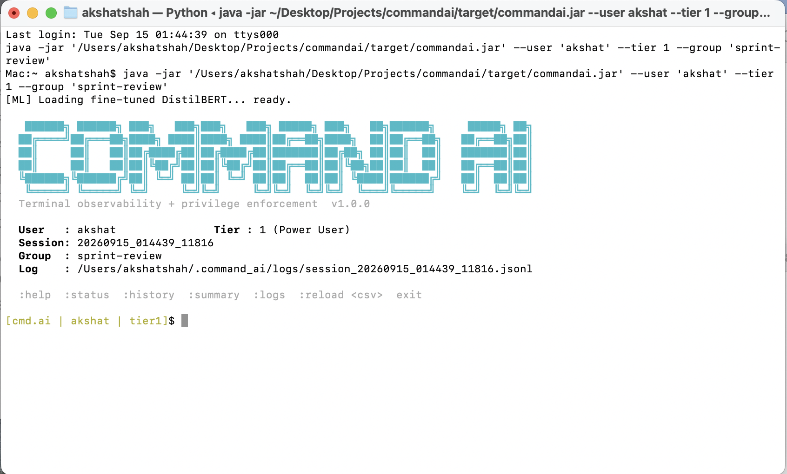
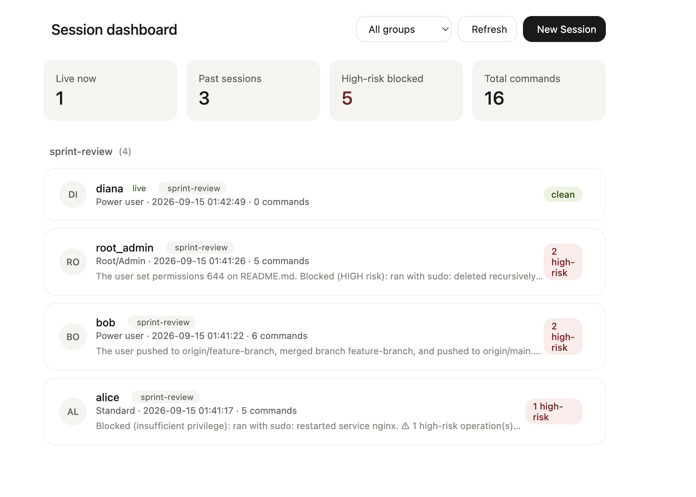
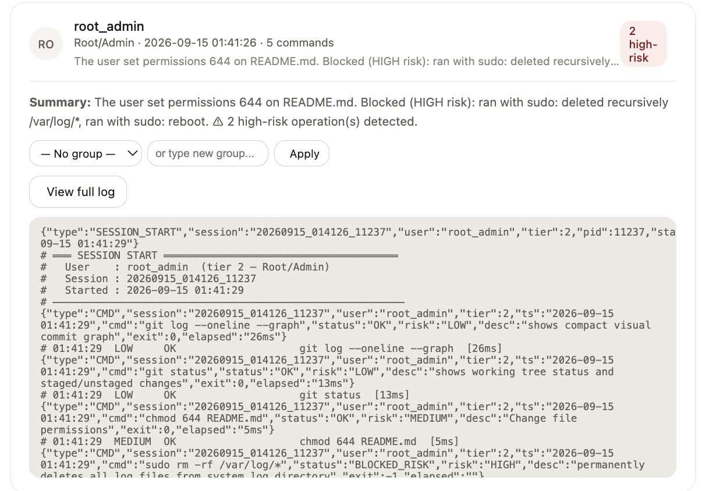

# Command.ai

> Terminal observability tool with ML-based risk assessment and role-based privilege enforcement.

## About

Command.ai sits between you and your shell. Every command you type is intercepted before it runs, classified by risk (LOW / MEDIUM / HIGH), checked against your privilege tier, and logged to a structured file — then, at the end of the session, the whole thing gets summarized by AI in plain English. A local web dashboard lets you see and manage sessions across every terminal you've opened, live or past.

**Core capabilities:**

- **Command interception** — every command is captured before execution, not just logged after the fact
- **ML-based risk classification** — a locally fine-tuned DistilBERT model scores each command LOW/MEDIUM/HIGH, with a fast regex/rule-based fallback if the ML engine isn't available
- **Role-based privilege enforcement** — three access tiers (Standard / Power User / Root-Admin), each capped at a maximum command risk level
- **HIGH-risk commands never execute, for anyone** — this isn't just an access check; even the most privileged tier can't run a HIGH-risk command
- **Structured audit logging** — every command, decision, and outcome is written to JSONL, one file per session
- **AI session summaries** — a plain-English recap of what happened in a session, generated on demand or at exit
- **Web dashboard** — browse live and past sessions, group them, drill into full logs, kill live sessions, or launch new ones, all from a browser
- **1,000+ command dataset out of the box** — shell basics, git, docker, Kubernetes, cloud CLIs, and more, doubling as the training set for the risk model

## Contents

- [Demo](#demo)
- [How it works](#how-it-works)
- [Getting started](#getting-started)
- [Usage](#usage)
- [Privilege tiers](#privilege-tiers)
- [Risk levels](#risk-levels)
- [Commands CSV format](#commands-csv-format)
- [Session log format](#session-log-format)
- [Dashboard](#dashboard)
- [Training the risk model](#training-the-risk-model)
- [Future scope](#future-scope)
- [Project structure](#project-structure)

---

## Demo


*A live session: LOW/MEDIUM commands run normally, HIGH-risk commands are blocked before they ever execute.*


*The dashboard: live + past sessions across every terminal, grouped, with per-session risk counts at a glance.*


*Drilling into a session: the full JSONL command log plus an AI-generated summary of what happened.*

---

## How it works

1. You start a session with `java -jar commandai.jar`, optionally passing a username, privilege tier, and a commands CSV.
2. Every line you type is checked against the CSV first (exact/prefix match) for a known `privilege_level`; unknown commands fall through to a fast regex pre-screen, then the ML model.
3. If the command's risk level exceeds your tier, it's **blocked** and logged — nothing runs.
4. If the risk is HIGH, it's **always blocked**, regardless of tier.
5. Otherwise the command actually executes via a real shell, and the outcome (exit code, timing) is logged alongside the risk classification.
6. On `:summary` or `exit`, the session's command history is sent to a summarization model for a plain-English recap.
7. `--dashboard` starts a local web server that reads every session's log/index files and lets you browse, group, and manage them from a browser.

---

## Getting started

### 1. Download the project

```bash
git clone https://github.com/akshatrshah/command.ai.git
cd command.ai
```

(Or download the ZIP from the GitHub repo page and extract it, if you don't use git.)

### 2. Install requirements

**Java** (required):
- JDK 21+ to build, JRE 21+ to run
- Maven 3.6+ to build

**Python** (optional, for the ML risk model):
```bash
pip install transformers torch sentencepiece
```
> The Python sidecar is bundled inside the JAR and extracted to `~/.command_ai/ml_engine.py` on first run. If Python or these packages aren't available, Command.ai automatically falls back to fast rule-based risk assessment — it still works, just without the fine-tuned model.

### 3. Build it

```bash
mvn clean package
```

This produces a single runnable fat JAR at `target/commandai.jar` (bundles the ML sidecar and dashboard UI inside it).

### 4. Run it

```bash
java -jar target/commandai.jar --commands data/commands.csv
```

You'll be prompted for a username and privilege tier if you don't pass them as flags (see [Usage](#usage) below). From there, just use your terminal normally — Command.ai intercepts, classifies, and logs every command you run.

---

## Usage

### CLI flags

| Flag | Description |
|---|---|
| `--commands <path>` | Load a commands CSV at startup |
| `--user <name>` | Set the session's username (skips the prompt) |
| `--tier <0\|1\|2>` | Set the session's privilege tier (skips the prompt) |
| `--group <name>` | Tag this session for the dashboard (optional) |
| `--dashboard` | Launch the web dashboard instead of a terminal session |
| `--help`, `-h` | Show help |

```bash
# Basic — prompts for user/tier interactively
java -jar target/commandai.jar

# With your commands CSV loaded at startup
java -jar target/commandai.jar --commands data/commands.csv

# Specify user and tier up front (skip prompts)
java -jar target/commandai.jar --user alice --tier 1 --commands data/commands.csv --group sprint-review

# Multiple terminals — each gets its own log file, no conflicts
java -jar target/commandai.jar --user bob --tier 2 &
java -jar target/commandai.jar --user alice --tier 0 &

# Browse every session across every terminal
java -jar target/commandai.jar --dashboard
```

### Built-in controls (type these inside a session)

| Command | Action |
|---|---|
| `:help` | Show help |
| `:status` | Session info, ML engine status, loaded commands |
| `:history` | All commands run this session |
| `:summary` | AI-generated session summary |
| `:reload <path>` | Hot-reload a new commands CSV |
| `exit` / `quit` | End session (prints summary first) |

---

## Privilege tiers

| Tier | Role | Access |
|---|---|---|
| 0 | Standard | Safe / read-only commands only |
| 1 | Power User | All except tier-2-only (sudo, rm -rf…) |
| 2 | Root/Admin | All commands |

Higher number = more privileged (tier 2 is highest). A user can run any command whose `privilege_level` is ≤ their own tier.

## Risk levels

| Risk | Action |
|---|---|
| HIGH | Blocked + logged — never executes, no matter who runs it |
| MEDIUM | Executes normally, logged for audit |
| LOW | Executes immediately |

Risk is assessed by a local fine-tuned DistilBERT model, falling back to zero-shot classification, then a fast regex pre-screen for known dangerous patterns (fork bombs, `rm -rf`, disk writes, etc.) if no ML model is available.

## Commands CSV format

```csv
command,description,privilege_level
ls,List directory contents,0
chmod,Change file permissions,1
sudo,Execute as superuser,2
```

- **command**: The base command name (e.g. `git`, `rm -rf`, `systemctl`) — matched by longest prefix against what you type
- **description**: Human-readable description (shown in warnings/logs)
- **privilege_level**: `0` (standard/safe), `1` (power user), `2` (root/destructive)

`data/commands.csv` ships with 1,000+ commands out of the box — shell basics, git, docker, cloud CLIs, Kubernetes, and more. It's also the same dataset used to fine-tune the risk model (see [Training the risk model](#training-the-risk-model)). Add your own and reload live without restarting:
```
:reload path/to/your_commands.csv
```

See [`data/README.md`](data/README.md) for the full privilege_level → risk mapping.

## Session log format

Logs are written to `~/.command_ai/logs/session_<timestamp>_<pid>.jsonl`.

Each line is a JSON object:
```json
{"type":"SESSION_START","session_id":"20240115_143022_12345","user":"alice","tier":2,"pid":12345,"started":"2024-01-15 14:30:22"}
{"type":"CMD","session":"20240115_143022_12345","user":"alice","tier":2,"ts":"2024-01-15 14:30:35","cmd":"ls -la","status":"OK","risk":"LOW","desc":"List directory contents","exit":0,"elapsed":"12ms"}
{"type":"CMD","session":"20240115_143022_12345","user":"alice","tier":2,"ts":"2024-01-15 14:31:02","cmd":"sudo rm -rf /var","status":"BLOCKED_RISK","risk":"HIGH","desc":"Recursively force-delete files","exit":-1,"elapsed":""}
```

---

## Dashboard

```bash
java -jar target/commandai.jar --dashboard
```

Opens a local web server (default `http://localhost:7878/`) that reads every session's log and index file under `~/.command_ai/`. From there you can:

- See **live** sessions (currently open terminals) and **past** sessions side by side
- Filter/browse by **group** (whatever you passed via `--group`)
- Open any session to see its **full command log** and its **AI-generated summary**
- **Kill** a live session remotely
- **Launch** a brand-new session directly from the browser, which opens a new terminal window for you

---

## Training the risk model

The fine-tuned risk classifier isn't trained automatically — see [`ml/README.md`](ml/README.md) for how to train and evaluate it against `data/commands.csv`. In short:

```bash
cd ml
python3 train.py --data ../data/commands.csv   # fine-tunes DistilBERT, saves to ~/.command_ai/model/
python3 test_model.py                          # compares rule-based vs. fine-tuned accuracy
```

---

## Future scope

Things that would move this from a personal/local tool toward something production-ready for a team:

- **A real authentication system.** Right now `--user` is just a string you pass on the command line — there's no login, password, or identity verification behind it. A production version would authenticate users (e.g. SSO/OAuth against the company identity provider) and derive their privilege tier from an actual role, not a CLI flag anyone can set to whatever they want.
- **A centralized log store.** Logs currently live per-machine at `~/.command_ai/logs/`, so there's no way to see activity across a whole team or fleet in one place. A production version would ship session logs to a central store (e.g. a small backend service + database, or a hosted logging pipeline) so an admin/security team could query and audit activity across every machine, not just one.
- **Tamper-evident logging.** Once logs are centralized, making them append-only/signed would guarantee the audit trail can't be edited after the fact, even by the user who generated it.
- **Role management beyond 3 hardcoded tiers.** A real RBAC system with custom roles/permissions per team, rather than a fixed Standard/Power User/Root scale.
- **Alerting.** Push a Slack/webhook notification when a HIGH-risk command is attempted, instead of only surfacing it in the dashboard after the fact.
- **Fleet-wide dashboard.** Extend the dashboard's Launch/Kill/browse flow to every machine on a team, not just the local one — a natural extension once logs are centralized.

---

## Project structure

```
command.ai/
├── pom.xml                                # Maven build
├── README.md
├── demo/                                  # Screenshots
│   └── screenshots/
│       ├── live-terminal-session.png
│       ├── dashboard-overview.png
│       └── session-detail-summary.png
├── data/
│   ├── README.md                          # privilege_level → risk mapping
│   └── commands.csv                       # 1,000+ commands (app data + ML training set)
├── ml/
│   ├── README.md
│   ├── train.py                           # Fine-tunes the DistilBERT risk model
│   └── test_model.py                      # Evaluates rule-based vs fine-tuned model
└── src/
    └── main/
        ├── java/ai/command/
        │   └── CommandAI.java             # Entire application (single file)
        └── resources/
            ├── ml_engine.py               # ML sidecar (bundled into JAR)
            └── dashboard.html             # Web dashboard UI (bundled into JAR)
```